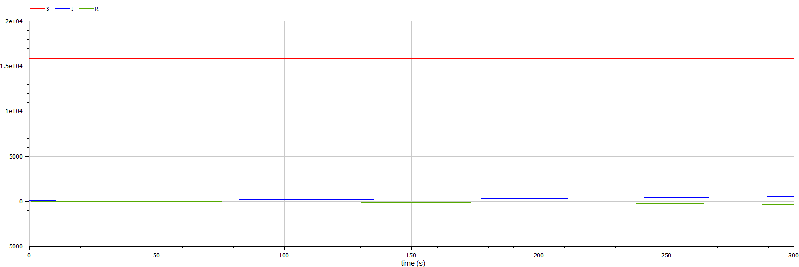
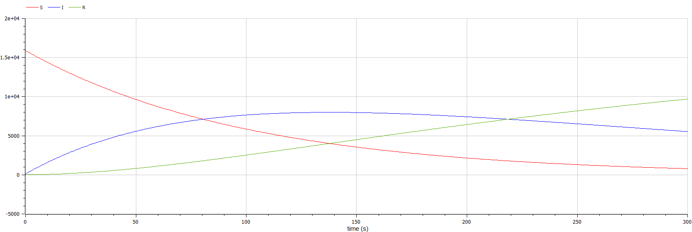

---
## Front matter
lang: ru-RU
title: Модель эпидемии SIR
author: |
	 Кеан Путхеаро	НПИбд-02-20\inst{1}

institute: |
	\inst{1}Российский Университет Дружбы Народов

date: 14 марта, 2023, Москва, Россия

## Formatting
mainfont: PT Serif
romanfont: PT Serif
sansfont: PT Sans
monofont: PT Mono
toc: false
slide_level: 2
theme: metropolis
header-includes: 
 - \metroset{progressbar=frametitle,sectionpage=progressbar,numbering=fraction}
 - '\makeatletter'
 - '\beamer@ignorenonframefalse'
 - '\makeatother'
aspectratio: 43
section-titles: true

---

# Цели и задачи работы

## Цель лабораторной работы

Изучить модель эпидемии $SIR$

## Задание к лабораторной работе

1.	Изучить модель эпидемии
2.	Построить графики изменения числа особей в каждой из трех групп. Рассмотреть, как будет протекать эпидемия в случае: $I(0)\leq I^*$, $I(0)>I^*$

# Процесс выполнения лабораторной работы

## Теоретический материал 

Предположим, что некая популяция, состоящая из $N$ особей, подразделяется на три группы. Первая группа - это восприимчивые к болезни, но пока здоровые особи - $S(t)$. Вторая группа – это число инфицированных особей, которые также являются распространителями инфекции - $I(t)$. А третья группа $R(t)$ – это здоровые особи с иммунитетом к болезни. 
До того, как число заболевших не превышает критического значения $I^*$, считаем, что все больные изолированы и не заражают здоровых. Когда $I(t)> I^*$, тогда инфицирование способны заражать восприимчивых к болезни особей. 

## Теоретический материал 

Cкорость изменения числа $S(t)$ меняется по следующему закону:

$$
\frac{dS}{dt}=
 \begin{cases}
	-\alpha S &\text{,если $I(t) > I^*$}
	\\   
	0 &\text{,если $I(t) \leq I^*$}
 \end{cases}
$$

## Теоретический материал

Cкорость изменения числа инфекционных особей:

$$
\frac{dI}{dt}=
 \begin{cases}
	\alpha S -\beta I &\text{,если $I(t) > I^*$}
	\\   
	-\beta I &\text{,если $I(t) \leq I^*$}
 \end{cases}
$$

## Теоретический материал

Cкорость изменения выздоравливающих особей:

$$\frac{dR}{dt} = \beta I$$

Постоянные пропорциональности $\alpha, \beta$ - это коэффициенты заболеваемости и выздоровления соответственно.

Для анализа картины протекания эпидемии необходимо рассмотреть два случая:  $I(0) \leq I^*$ и  $I(0)>I^*$

## Условие задачи

На одном острове вспыхнула эпидемия. Известно, что из всех проживающих на острове 
$N=16000$ в момент начала эпидемии $(t=0)$ число заболевших людей 
(являющихся распространителями инфекции) $I(0)=116$, А число здоровых людей с иммунитетом 
к болезни $R(0)=16$. Таким образом, число людей восприимчивых к болезни, 
но пока здоровых, в начальный момент времени $S(0)=N-I(0)-R(0)$.
Постройте графики изменения числа особей в каждой из трех групп.

Рассмотрите, как будет протекать эпидемия в случае:

1.	$I(0)\leq I^*$
2.	$I(0)>I^*$

## Графики изменения численности в первом случае

{ #fig:001 width=70% height=70% }

## Графики изменения численности во втором случае

{ #fig:002 width=70% height=70% }

# Выводы по проделанной работе

## Вывод

В ходе выполнения лабораторной работы была изучена модель $SIR$ и построены графики.