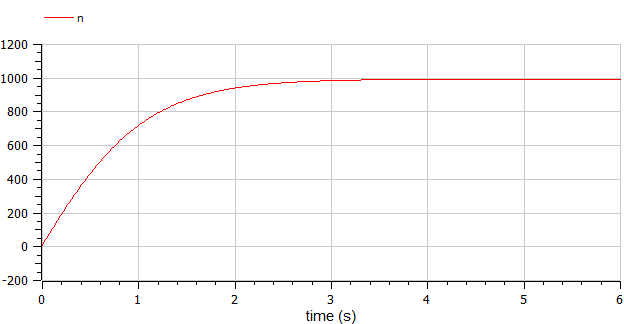
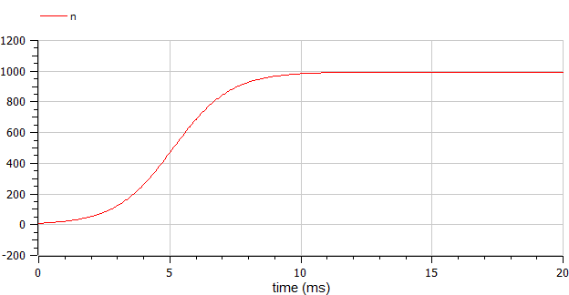
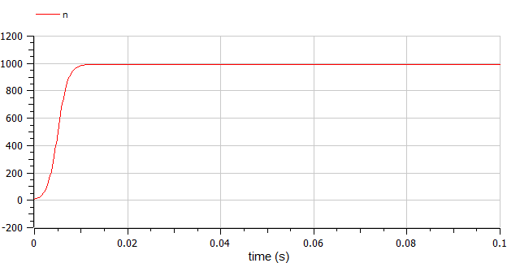
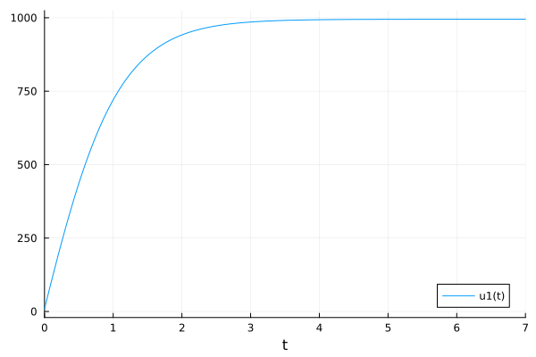
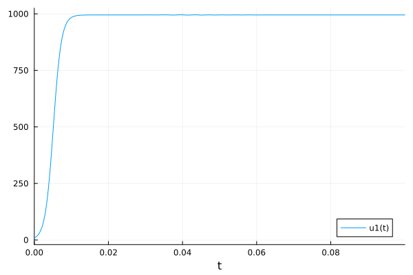

---
## Front matter
lang: ru-RU
title: Модель распространения рекламы
author: |
	 Кеан Путхеаро	НПИбд-02-20\inst{1}

institute: |
	\inst{1}Российский Университет Дружбы Народов

date: 21 марта, 2023, Москва, Россия

## Formatting
mainfont: PT Serif
romanfont: PT Serif
sansfont: PT Sans
monofont: PT Mono
toc: false
slide_level: 2
theme: metropolis
header-includes: 
 - \metroset{progressbar=frametitle,sectionpage=progressbar,numbering=fraction}
 - '\makeatletter'
 - '\beamer@ignorenonframefalse'
 - '\makeatother'
aspectratio: 43
section-titles: true

---

# Цели и задачи работы

## Цель лабораторной работы

Изучить модель эффективности рекламы

## Задание к лабораторной работе

1.	Изучить модель эфеективности рекламы
2.	Построить графики распространения рекламы в заданных случайх
3.	Определить для случая 2 момент времени, в который скорость распространения рекламы будет максимальной

# Процесс выполнения лабораторной работы

## Теоретический материал 

$\frac{dn}{dt}$ - скорость изменения со временем числа потребителей, узнавших о товаре и готовых его купить,

$t$ - время, прошедшее с начала рекламной кампании,

$N$ - общее число потенциальных платежеспособных покупателей,

$n(t)$ - число  уже информированных клиентов.

## Теоретический материал 

Величина $n(t)$ пропорциональна числу покупателей, еще не знающих о нем, это описывается следующим образом
$\alpha _1(t)(N-n(t))$, где $\alpha _1>0$ -  характеризует интенсивность рекламной кампании.
Помимо этого, узнавшие о товаре потребители также распространяют полученную информацию среди потенциальных покупателей, не знающих о нем. Этот вклад в рекламу описывается величиной  $\alpha _2(t)n(t)(N-n(t))$. эта величина увеличивается с увеличением потребителей узнавших о товаре.

## Теоретический материал 

Математическая модель распространения рекламы описывается уравнением:

$$\frac{dn}{dt} = (\alpha _1(t) + \alpha _2(t)n(t))(N-n(t))$$

## Теоретический материал

При $\alpha _1(t) >> \alpha _2(t)$ получается модель типа модели Мальтуса, решение которой имеет вид 

{ #fig:001 width=70% height=70% }

## Теоретический материал

В обратном случае $\alpha _1(t) << \alpha _2(t)$ получаем уравнение логистической кривой

{ #fig:002 width=70% height=70% }

## Условие задачи

Постройте график распространения рекламы, математическая модель которой описывается следующим уравнением:

1.	$\frac{dn}{dt} = (0.95 + 0.0008n(t))(N-n(t))$
2.	$\frac{dn}{dt} = (0.000095 + 0.92n(t))(N-n(t))$
3.	$\frac{dn}{dt} = (0.95\sin{t} + 0.93\cos{9*t}n(t))(N-n(t))$

При этом объем аудитории $N = 995$, в начальный момент о товаре знает 9 человек.

Для случая 2 определите в какой момент времени скорость распространения рекламы будет иметь максимальное значение.

## График в первом случае

{ #fig:003 width=70% height=70% }

## График во втором случае

{ #fig:004 width=70% height=70% }

максимальная скорость распространения при $t=0$

## График в третьем случае

{ #fig:005 width=70% height=70% }

# Выводы по проделанной работе

## Вывод

В ходе выполнения лабораторной работы была изучена модель эффективности рекламы и построены графики.