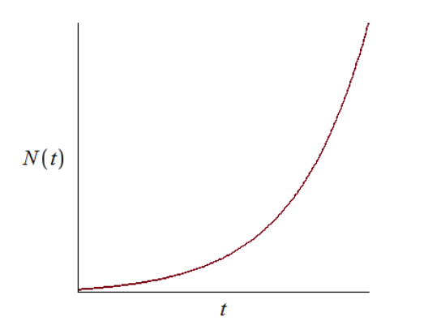
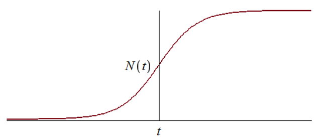
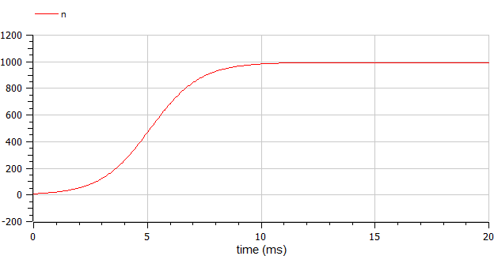
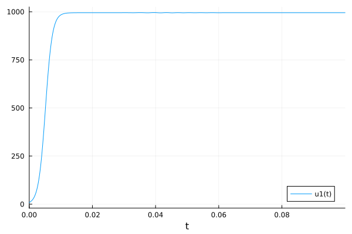

---
# Front matter
lang: ru-RU
title: "Отчет по лабораторной работе №7"
subtitle: "Модель распространения рекламы - вариант 12"
author: "Кеан Путхеаро	НПИбд-02-20"

# Formatting
toc-title: "Содержание"
toc: true # Table of contents
toc_depth: 2
lof: true # List of figures
fontsize: 12pt
linestretch: 1.5
papersize: a4paper
documentclass: scrreprt
polyglossia-lang: russian
polyglossia-otherlangs: english
mainfont: PT Serif
romanfont: PT Serif
sansfont: PT Sans
monofont: PT Mono
mainfontoptions: Ligatures=TeX
romanfontoptions: Ligatures=TeX
sansfontoptions: Ligatures=TeX,Scale=MatchLowercase
monofontoptions: Scale=MatchLowercase
indent: true
pdf-engine: lualatex
header-includes:
  - \linepenalty=10 # the penalty added to the badness of each line within a paragraph (no associated penalty node) Increasing the υalue makes tex try to haυe fewer lines in the paragraph.
  - \interlinepenalty=0 # υalue of the penalty (node) added after each line of a paragraph.
  - \hyphenpenalty=50 # the penalty for line breaking at an automatically inserted hyphen
  - \exhyphenpenalty=50 # the penalty for line breaking at an explicit hyphen
  - \binoppenalty=700 # the penalty for breaking a line at a binary operator
  - \relpenalty=500 # the penalty for breaking a line at a relation
  - \clubpenalty=150 # extra penalty for breaking after first line of a paragraph
  - \widowpenalty=150 # extra penalty for breaking before last line of a paragraph
  - \displaywidowpenalty=50 # extra penalty for breaking before last line before a display math
  - \brokenpenalty=100 # extra penalty for page breaking after a hyphenated line
  - \predisplaypenalty=10000 # penalty for breaking before a display
  - \postdisplaypenalty=0 # penalty for breaking after a display
  - \floatingpenalty = 20000 # penalty for splitting an insertion (can only be split footnote in standard LaTeX)
  - \raggedbottom # or \flushbottom
  - \usepackage{float} # keep figures where there are in the text
  - \usepackage{amsmath}
  - \floatplacement{figure}{H} # keep figures where there are in the text
---

# Цель работы

Изучить модель эффективности рекламы

# Задание

1.	Изучить модель эфеективности рекламы
2.	Построить графики распространения рекламы в заданных случайх
3.	Определить для случая 2 момент времени, в который скорость распространения рекламы будет максимальной

# Выполнение лабораторной работы

## Теоретические сведения

Организуется рекламная кампания нового товара или услуги. Необходимо, чтобы прибыль будущих продаж с избытком покрывала издержки на рекламу. Вначале расходы могут превышать прибыль, поскольку лишь малая часть потенциальных покупателей будет информирована о новинке. Затем, при увеличении числа продаж, возрастает и прибыль, и, наконец, наступит момент, когда рынок насытиться, и рекламировать товар станет бесполезным.

Предположим, что торговыми учреждениями реализуется некоторая продукция, о которой в момент времени $t$ из числа потенциальных покупателей $N$ знает лишь $n$ покупателей. Для ускорения сбыта продукции запускается реклама по радио, телевидению и других средств массовой информации. После запуска рекламной кампании информация о продукции начнет распространяться среди потенциальных покупателей путем общения друг с другом. Таким образом, после запуска рекламных объявлений скорость изменения числа знающих о продукции людей пропорциональна как числу знающих о товаре покупателей, так и числу покупателей о нем не знающих

Модель рекламной кампании описывается следующими величинами.
Считаем, что $\frac{dn}{dt}$ - скорость изменения со временем числа потребителей, узнавших о товаре и готовых его купить,
$t$ - время, прошедшее с начала рекламной кампании,
$N$ - общее число потенциальных платежеспособных покупателей,
$n(t)$ - число  уже информированных клиентов.
Эта величина пропорциональна числу покупателей, еще не знающих о нем, это описывается следующим образом
$\alpha _1(t)(N-n(t))$, где $\alpha _1>0$ -  характеризует интенсивность рекламной кампании (зависит от затрат на рекламу в данный момент времени).
Помимо этого, узнавшие о товаре потребители также распространяют полученную информацию среди потенциальных покупателей, не знающих о нем (в этом случае работает т.н. сарафанное радио). Этот вклад в рекламу описывается величиной  $\alpha _2(t)n(t)(N-n(t))$. эта величина увеличивается с увеличением потребителей узнавших о товаре.

Математическая модель распространения рекламы описывается уравнением:

$$\frac{dn}{dt} = (\alpha _1(t) + \alpha _2(t)n(t))(N-n(t))$$

При $\alpha _1(t) >> \alpha _2(t)$ получается модель типа модели Мальтуса, решение которой имеет вид 

{ #fig:001 width=70% height=70% }

В обратном случае $\alpha _1(t) << \alpha _2(t)$ получаем уравнение логистической кривой

{ #fig:002 width=70% height=70% }

## Задача

{ #fig:000 width=70% height=70% }

Постройте график распространения рекламы, математическая модель которой описывается следующим уравнением:

1.	$\frac{dn}{dt} = (0.95 + 0.0008n(t))(N-n(t))$
2.	$\frac{dn}{dt} = (0.000095 + 0.92n(t))(N-n(t))$
3.	$\frac{dn}{dt} = (0.95\sin{t} + 0.93\cos{9*t}n(t))(N-n(t))$

При этом объем аудитории $N = 995$, в начальный момент о товаре знает 9 человек.

Для случая 2 определите в какой момент времени скорость распространения рекламы будет иметь максимальное значение.

Решение в OpenModelica

```
model pr7

parameter Real a = 0.95;
parameter Real b = 0.0008;
parameter Real N = 995;

Real n(start=9);

equation
 der(n) = (a+b*n)*(N-n);
end pr7;
```

{ #fig:003 width=70% height=70% }


```
model pr7

parameter Real a = 0.000095;
parameter Real b = 0.92;
parameter Real N = 995;

Real n(start=9);

equation
 der(n) = (a+b*n)*(N-n);
end pr7;
```

{ #fig:004 width=70% height=70% }

максимальная скорость распространения достигается при $t=0$

```
model pr7

parameter Real a = 0.95;
parameter Real b = 0.93;
parameter Real N = 995;

Real n(start=9);

equation
 der(n) = (a*sin(time)+b*cos(9*time)*n)*(N-n);
end pr7;
```

{ #fig:005 width=70% height=70% }

Решение в Julia

```
1032205169%70+1

using Plots
using DifferentialEquations

a = 0.95
b = 0.0008
N = 995
n = 9

tmax = 7
tspan = (0, tmax)
t = collect(LinRange(0, tmax, 500))
    
function syst(dy, y, p, t)
    dy[1] = (a+b*y[1])*(N-y[1])
end

prob = ODEProblem(syst, [n], tspan)
sol = solve(prob, saveat=t)

plot(sol)

savefig("04.png")

a = 0.000095
b = 0.92
N = 995
n = 9

tmax = 0.1
tspan = (0, tmax)
t = collect(LinRange(0, tmax, 500))
    
function syst(dy, y, p, t)
    dy[1] = (a+b*y[1])*(N-y[1])
end

prob = ODEProblem(syst, [n], tspan)
sol = solve(prob, saveat=t)

plot(sol)

savefig("05.png")

a = 0.95
b = 0.93
N = 995
n = 9

tmax = 0.1
tspan = (0, tmax)
t = collect(LinRange(0, tmax, 500))
    
function syst(dy, y, p, t)
    dy[1] = (a*sin(t)+b*cos(9*t)*y[1])*(N-y[1])
end

prob = ODEProblem(syst, [n], tspan)
sol = solve(prob, saveat=t)

plot(sol)

savefig("06.png")
```

{ #fig:006 width=70% height=70% }

{ #fig:007 width=70% height=70% }

{ #fig:008 width=70% height=70% }


# Выводы

В ходе выполнения лабораторной работы была изучена модель эффективности рекламы и построены графики.


# Список литературы {.unnumbered}

1. [Модель Мальтуса](http://km.mmf.bsu.by/courses/2018/mathmod1/MM_LB1_Population_2019.pdf)
2. [Логистическая модель роста](https://studopedia.ru/29_5129_logisticheskaya-model-rosta.html)